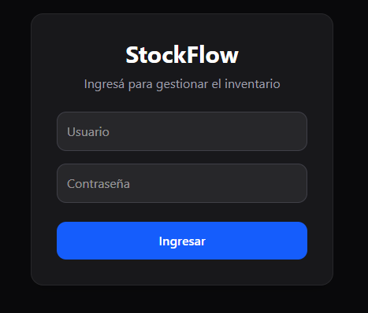
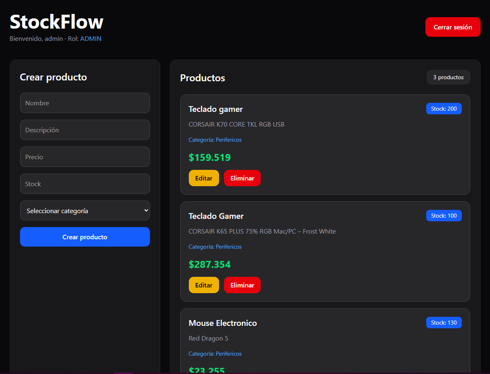
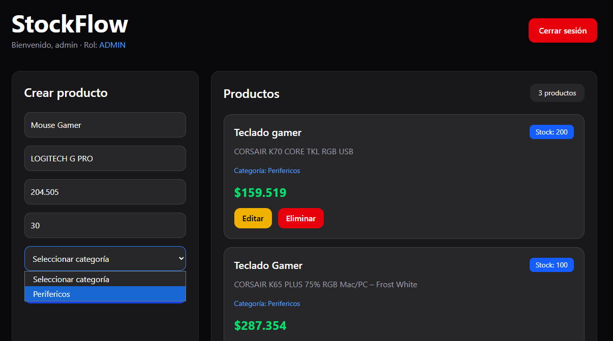
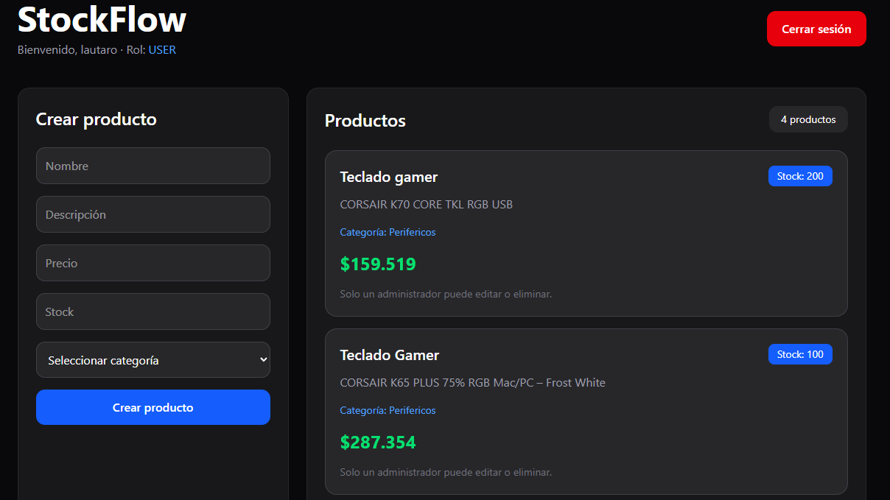

# 🚀 StockFlow

Sistema full stack de gestión de inventario desarrollado con:

- React + Vite
- Tailwind CSS
- Spring Boot
- PostgreSQL
- JWT Authentication
- Spring Security

---

# 📸 Features

✅ Login y autenticación JWT  
✅ Roles ADMIN / USER  
✅ CRUD completo de productos  
✅ CRUD de categorías  
✅ Relación productos-categorías  
✅ Protección de rutas con Spring Security  
✅ Frontend moderno con Tailwind CSS  
✅ API REST completa  
✅ Persistencia en PostgreSQL  

---

# 🛠️ Tecnologías

## Frontend
- React
- Vite
- Axios
- Tailwind CSS

## Backend
- Java 21
- Spring Boot
- Spring Security
- JWT
- Maven
- JPA / Hibernate

## Base de datos
- PostgreSQL

---

# 🔐 Seguridad

El proyecto implementa:

- JWT Authentication
- Spring Security
- Protección de endpoints
- Manejo de roles
- Authorization Bearer Token

---


# 📂 Estructura

```
Stockflow/
│
├── backend/
│
└── frontend/ 
```

---


# ⚙️ Configuración backend

- application.properties
- spring.datasource.url=jdbc:postgresql://localhost:5432/stockflow
- spring.datasource.username=postgres
- spring.datasource.password=YOUR_PASSWORD


▶️ Ejecutar Backend

cd backend
.\mvnw spring-boot:run

▶️ Ejecutar Frontend

cd frontend
npm install
npm run dev

---

# 📸 Screenshots

## 🔐 Login



---

## 📦 Dashboard principal



---

## ➕ Crear producto



---

## 👤 Rol USER



